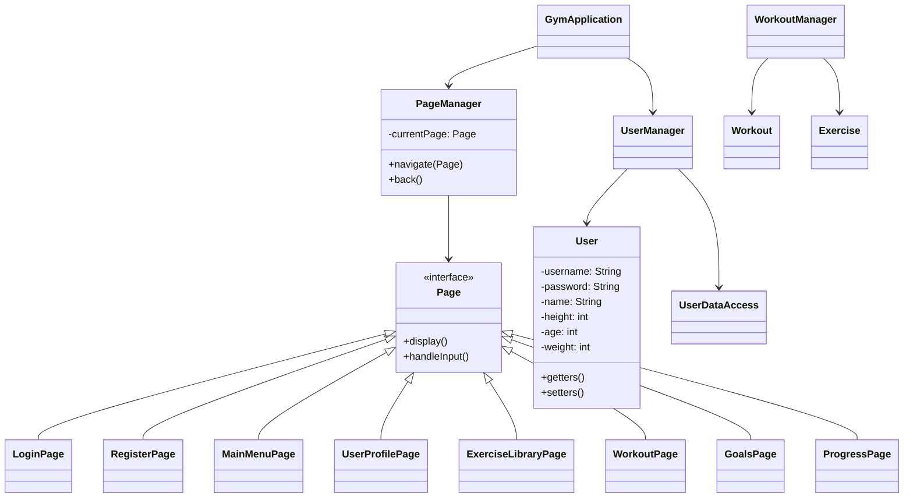

# Gym Tracker Application

A Java-based console application for tracking your workouts, exercises, and fitness progress.

## Overview

Gym Tracker is a comprehensive fitness tracking solution that allows users to register, log workouts, track progress, and manage personal fitness goals. The application stores user data and workout history in JSON format for persistence.

## Features

### User Management
- **User Registration & Login**: Create an account with personal details (name, age, weight, height) and log in securely
- **Profile Management**: View and update your profile information
- **BMI Calculation**: Automatically calculate and categorize your Body Mass Index

### Exercise Library
- **Predefined Exercises**: Access a comprehensive library of common exercises
- **Custom Exercises**: Add your own exercises to the library
- **Persistent Storage**: All exercises are saved between sessions

### Workout Tracking
- **Create & Record Workouts**: Start a new workout and record exercises, sets, reps, and weight
- **Workout Duration**: Automatically track the duration of each workout
- **Workout History**: Review your previous workout sessions

### Progress Tracking
- **Workout Summary**: View stats on total workouts, duration, and average session length
- **Goal Setting**: Set specific strength and fitness goals
- **Goal Tracking**: Monitor progress towards your fitness objectives

## Application Structure



## Getting Started

### Prerequisites
- Java 21 or higher
- Maven

### Installation
1. Clone the repository
   ```
   git clone https://github.com/yourusername/gym-tracker.git
   cd gym-tracker
   ```

2. Build the project with Maven
   ```
   mvn clean package
   ```

3. Run the application
   ```
   java -jar target/GymApplication-1.0-SNAPSHOT.jar
   ```

## Usage

1. Start the application
2. Choose to register a new account or log in
3. Navigate the menu to:
   - Start a new workout
   - View workout history
   - Set and view goals
   - Update user information
   - Save and log out

## Technologies Used

- Java 21
- Maven for dependency management
- Gson for JSON serialization
- JUnit for unit testing

## Development

### Running Tests
```
mvn test
```

### Project Structure
- `src/main/java`: Main application code
- `src/test/java`: Unit tests
- `resources`: Configuration files and stored user data

## Contributors

- Ethan Greene
- Daniel Huang
