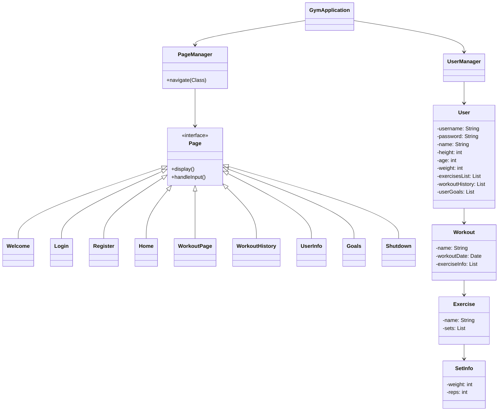

# Gym Tracker Application

A Java-based console application for tracking your workouts, exercises, and fitness progress.

## Overview

Gym Tracker is a comprehensive fitness tracking solution that allows users to register, log workouts, track progress, and manage personal fitness goals. The application stores user data and workout history in JSON format for persistence between sessions.

## Features

### User Management
- **User Registration & Login**: Create an account with personal details (name, age, weight, height) and log in securely
- **Profile Management**: View and update your profile information
- **BMI Calculation**: Automatically calculate and categorize your Body Mass Index based on height and weight

### Exercise Library
- **Predefined Exercises**: Access a comprehensive library of common exercises including bench press, squats, curls, etc.
- **Exercise Management**: Select from the library when creating workouts
- **Persistent Storage**: All exercises are saved between sessions

### Workout Tracking
- **Create & Record Workouts**: Start a new workout with a custom name and record exercises, sets, reps, and weight
- **Workout Details**: Track detailed information for each set including weight and repetitions
- **Workout History**: Review your previous workout sessions with complete details

### Progress & Goals
- **Workout History**: View detailed logs of all past workout sessions
- **Goal Setting**: Set specific strength and fitness goals (in development)
- **User Stats**: Track changes in your personal metrics over time

## Application Structure

The application follows a page-based navigation system with a clean separation of concerns:



## Getting Started

### Prerequisites
- Java 21 or higher
- Maven

### Installation
1. Clone the repository
   ```
   git clone https://github.com/yourusername/gym-tracker.git
   cd gym-tracker
   ```

2. Build the project with Maven
   ```
   mvn clean package
   ```

3. Run the application
   ```
   java -jar target/GymApplication-1.0-SNAPSHOT.jar
   ```

## Usage

1. Start the application
2. Choose to register a new account or log in with existing credentials
3. Navigate the menu to:
   - Start a new workout
   - View workout history
   - Set and view goals
   - Update your user information
   - Calculate your BMI
   - Save and log out

## Technologies Used

- Java 21
- Maven for dependency management
- Gson for JSON serialization/deserialization
- JUnit for unit testing

## Development

### Running Tests
```
mvn test
```

The application includes comprehensive tests for all major components including:
- User management functionality
- Workout tracking
- Page navigation
- Data persistence

### Project Structure
- `src/main/java`: Main application code
- `src/test/java`: Unit tests
- `resources`: Configuration files and stored user data

## Contributors

- Ethan Greene
- Daniel Huang

## Future Enhancements

- Graphical user interface using JavaFX or Swing
- Enhanced goal tracking with progress visualization
- Exercise categorization by muscle groups
- Export functionality for workout data
- Customizable workout templates
