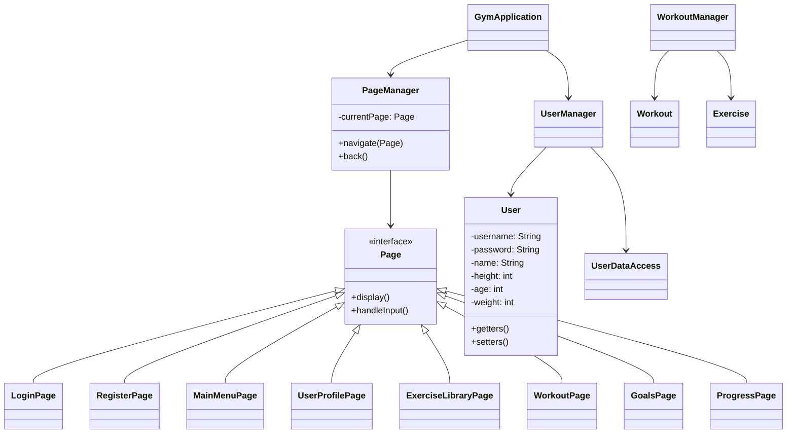

# This is my beautiful gym tracking application

```mermaid
classDiagram
    GymApplication --> UserManager
    GymApplication --> PageManager
    
    PageManager --> Page
    Page <|-- LoginPage
    Page <|-- RegisterPage
    Page <|-- MainMenuPage
    Page <|-- UserProfilePage
    Page <|-- ExerciseLibraryPage
    Page <|-- WorkoutPage
    Page <|-- GoalsPage
    Page <|-- ProgressPage
    
    UserManager --> User
    UserManager --> UserDataAccess
    
    WorkoutManager --> Workout
    WorkoutManager --> Exercise
    
    class Page {
        <<interface>>
        +display()
        +handleInput()
    }
    
    class User {
        -username: String
        -password: String
        -name: String
        -height: int
        -age: int
        -weight: int
        +getters()
        +setters()
    }
    
    class PageManager {
        -currentPage: Page
        +navigate(Page)
        +back()
    }
```