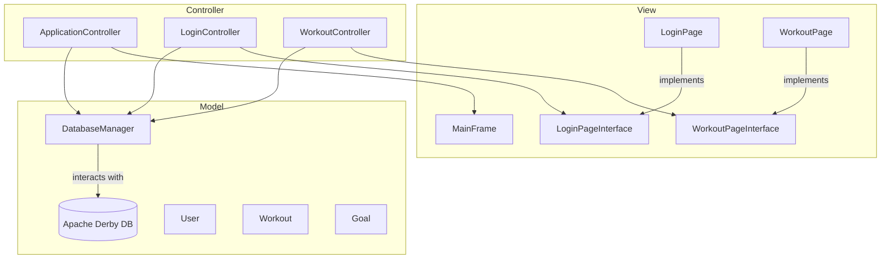

# Gym Tracker - Dual Interface Fitness Application

[](https://github.com/ethangreeney/GymTracker/releases/latest)
[](https://opensource.org/licenses/MIT)
[](https://www.oracle.com/java/technologies/javase/jdk21-archive-downloads.html)
[](https://maven.apache.org/)

A comprehensive Java application for tracking workouts, managing fitness goals, and monitoring personal progress, available in both a modern Graphical User Interface (GUI) and a classic Command-Line Interface (CLI).

### 🎥 Project Demo
Click the thumbnail below to watch a full video demonstration of the GymTracker application.

[](https://youtu.be/Isi-PJGszOA)

---

## ✨ Key Features
*   **Dual Interfaces:** Choose between a feature-rich GUI or a lightweight CLI.
*   **User Authentication:** Secure user registration and login for both versions.
*   **Workout Logging:** Record detailed workout sessions, including exercises, sets, reps, and weights.
*   **Goal Management:** Create personal fitness goals and track their completion.
*   **Comprehensive History:** Access a complete, chronologically sorted history of all past workouts.
*   **User Metrics:** Automatically calculates Body Mass Index (BMI) based on profile information.
*   **Persistent Storage:**
    *   **GUI:** Uses an embedded **Apache Derby SQL database**.
    *   **CLI:** Uses portable **JSON files** for data persistence.

---

## 🏗️ Application Architecture
The project offers two standalone user experiences with different underlying technologies.

### GUI (Graphical User Interface)
The GUI version is built with Java Swing and follows the **Model-View-Controller (MVC)** design pattern.


*   **Model:** Manages data logic and database interactions via a `DatabaseManager`.
*   **View:** Contains all Swing components and implements interfaces for decoupling.
*   **Controller:** Bridges the Model and View, handling user input and application flow.

### CLI (Command-Line Interface)
The CLI version provides a fast, terminal-based experience using a page-based navigation system.
*   **Navigation:** Uses a `PageManager` to navigate between different screens, each implementing a `Page` interface.
*   **Data Handling:** A `UserManager` class handles all user logic, serializing data to and from JSON files using the **Gson** library.
> **⚠️ Security Warning:** In the CLI version, passwords are currently stored in plaintext within the JSON file. This should be improved with hashing in a production environment.

---

## 🛠️ Technology Stack
*   **Language:** Java 21
*   **Build Tool:** Apache Maven
*   **GUI:** Java Swing, Apache Derby (Embedded), JDBC
*   **CLI:** Gson (for JSON serialization)

---

## 🚀 Getting Started

If you want to build the project from the source code, follow these steps.

1.  **Clone the repository:**
    ```bash
    git clone https://github.com/ethangreeney/GymTracker.git
    cd GymTracker
    ```

2.  **Build with Maven:**
    ```bash
    mvn clean package
    ```

3.  **Run the application** (from the project's root directory):
    *   **GUI Version:**
        ```bash
        java -cp target/GymApplication-1.0-SNAPSHOT.jar GUI.controller.ApplicationController
        ```
    *   **CLI Version:**
        ```bash
        java -cp target/GymApplication-1.0-SNAPSHOT.jar CLI.GymApplication
        ```

---

## 📦 Download the Latest Release

If you prefer to run the application without building it from source, you can download the latest pre-compiled `.jar` file from the Releases page.

1.  **Go to the [Latest Release page](https://github.com/ethangreeney/GymTracker/releases/latest).**
2.  **Download the `GymApplication-1.0-SNAPSHOT.jar` file** from the "Assets" section.
3.  **Run the application** from your terminal by navigating to the download directory:
    *   **GUI Version:**
        ```bash
        java -cp GymApplication-1.0-SNAPSHOT.jar GUI.controller.ApplicationController
        ```
    *   **CLI Version:**
        ```bash
        java -cp GymApplication-1.0-SNAPSHOT.jar CLI.GymApplication
        ```

---

## 🔮 Future Enhancements
*   Implement secure password hashing (e.g., using bcrypt).
*   Refactor to a shared data model for both GUI and CLI.
*   Add visual charts and progress reports.
*   Allow users to create and reuse workout templates.
*   Increase test coverage with a comprehensive test suite.

---

## 👥 Contributors
*   [Ethan Greene](https://github.com/ethangreeney)
*   [Daniel Huang](https://github.com/danhuang-dev)
