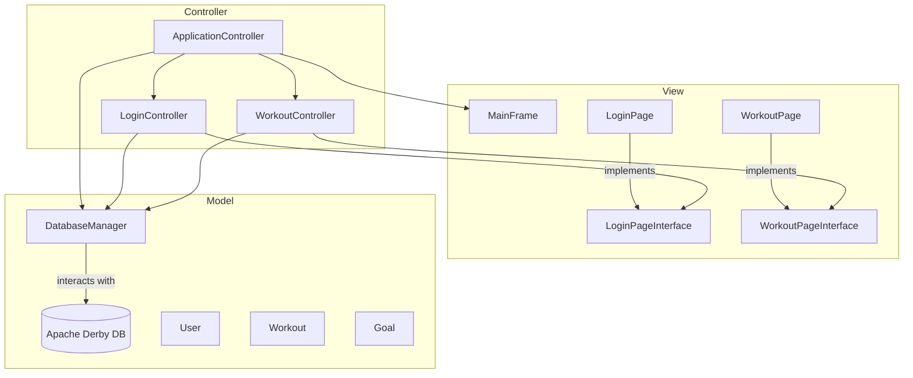

# Gym Tracker - Dual Interface Fitness Application

[](https://opensource.org/licenses/MIT)
[](https://www.oracle.com/java/technologies/javase/jdk21-archive-downloads.html)
[](https://maven.apache.org/)

A comprehensive Java application for tracking workouts, managing fitness goals, and monitoring personal progress, available in both a modern Graphical User Interface (GUI) and a classic Command-Line Interface (CLI).

---

## 📖 Table of Contents
*   [Overview](#-overview)
*   [Core Features](#-core-features)
*   [Application Architecture](#-application-architecture)
    *   [GUI (Graphical User Interface)](#gui-graphical-user-interface)
    *   [CLI (Command-Line Interface)](#cli-command-line-interface)
*   [Technology Stack](#-technology-stack)
*   [Getting Started](#-getting-started)
    *   [Prerequisites](#prerequisites)
    *   [Installation & Running](#installation--running)
*   [Usage Guide](#-usage-guide)
*   [Contributors](#-contributors)
*   [Future Enhancements](#-future-enhancements)

---

## 🌟 Overview

Gym Tracker is a versatile fitness application designed to cater to different user preferences by offering two distinct interfaces:
1.  **A rich Graphical User Interface (GUI)** built with Java Swing, providing a visually intuitive experience with robust database persistence.
2.  **A fast Command-Line Interface (CLI)** for users who prefer a terminal-based workflow, with data saved locally in JSON format.

Both versions allow users to meticulously log gym sessions, monitor progress over time, and manage fitness goals, ensuring a complete fitness tracking solution.

---

## 💪 Core Features

*   **Dual Interfaces:** Choose between a feature-rich GUI or a lightweight CLI.
*   **User Authentication:** Secure user registration and login for both versions.
*   **Profile Management:** Create and manage user profiles, including name, age, weight, and height.
*   **Workout Logging:** Record detailed workout sessions with custom names. Log individual exercises, including sets, repetitions, and weight.
*   **Exercise Library:** Select from a predefined list of common exercises or add your own custom exercises.
*   **Comprehensive History:** Access a complete, chronologically sorted history of all past workout sessions with detailed views.
*   **Goal Management:** Set personal fitness goals, track their creation date, and mark them as complete.
*   **User Metrics:** Automatically calculates and classifies your Body Mass Index (BMI) based on your profile information.
*   **Persistent Storage:**
    *   The **GUI** version uses an embedded **Apache Derby SQL database** for robust, relational data storage.
    *   The **CLI** version uses **JSON files** for simple, portable data persistence.

---

## 🏗️ Application Architecture

The project is organized into two main packages, `GUI` and `CLI`, each providing a complete, standalone user experience with different underlying technologies.

### GUI (Graphical User Interface)

The GUI version is built using **Java Swing** and follows a **Model-View-Controller (MVC)** design pattern for a clean separation of concerns.

*   **Model:** Contains the data logic. A `DatabaseManager` handles all JDBC communication with the Apache Derby database. Data entities like `User`, `Workout`, and `Goal` are defined in this layer.
*   **View:** Comprises all Swing components (`JPanel`, `JFrame`, etc.) that form the user interface. It implements interfaces (`LoginPageInterface`, `HomePageInterface`) to decouple from the controller.
*   **Controller:** Acts as the bridge between the Model and the View. It handles user input, processes data by calling the `DatabaseManager`, and updates the View. The `ApplicationController` is the main coordinator that manages page navigation.



### CLI (Command-Line Interface)
The CLI version provides a fast, terminal-based experience using a page-based navigation pattern.

*   **`Page` Interface:** Defines the contract for all displayable screens (`display`, `handleInput`). Implementations like `HomePage`, `LoginPage`, and `WorkoutPage` handle the logic for each screen.
*   **`PageManager`:** Manages navigation between different `Page` implementations.
*   **`UserManager`:** Handles all user-related logic, including loading from and saving to a `userInfo.json` file using the **Gson** library.
*   **Model Classes:** Simple Plain Old Java Objects (POJOs) like `User`, `Workout`, and `Goal` encapsulate the application's data.

> **⚠️ Security Warning:** In the CLI version, passwords are currently stored in plaintext within the JSON file. This is a security risk and should be improved with hashing in a production environment.

---

## 🛠️ Technology Stack
*   **Language:** Java 21
*   **Build Tool:** Apache Maven
*   **GUI:**
    *   **Framework:** Java Swing
    *   **Database:** Apache Derby (Embedded SQL Database)
    *   **Driver:** JDBC
*   **CLI:**
    *   **Library:** Gson (for JSON serialization)

---

## 🚀 Getting Started

Follow these instructions to get a copy of the project up and running on your local machine.

### Prerequisites
*   Java Development Kit (JDK) 21 or newer
*   Apache Maven

### Installation & Running
1.  **Clone the repository:**
    ```bash
    git clone https://github.com/ethangreeney/GymTracker.git
    cd GymTracker
    ```

2.  **Build the project using Maven:**
    This command compiles the source code and packages it into an executable JAR file.
    ```bash
    mvn clean package
    ```

3.  **Run the application:**
    You can run either the GUI or the CLI version. The necessary JAR file will be located in the `target` directory.

    *   **To run the GUI Application:**
        ```bash
        java -cp target/GymApplication-1.0-SNAPSHOT.jar GUI.controller.ApplicationController
        ```

    *   **To run the CLI Application:**
        ```bash
        java -cp target/GymApplication-1.0-SNAPSHOT.jar CLI.GymApplication
        ```

---

## 📋 Usage Guide

1.  Launch either the GUI or CLI application using the commands above.
2.  On the first screen, choose to **Register** a new account or **Login** with existing credentials.
3.  Once logged in, the Home screen provides the main navigation:
    *   **Start Workout:** Log a new gym session, including exercises, sets, reps, and weights.
    *   **View Workout History:** Review a detailed list of all your past workouts.
    *   **Set and View Goals:** Create new fitness goals and view the status of existing ones.
    *   **User Info:** View or update your profile (name, age, height, weight) and see your calculated BMI.
    *   **Logout:** Save all changes and exit the application gracefully.

---

## 👥 Contributors
*   Ethan Greene
*   Daniel Huang

---

## 🔮 Future Enhancements
*   **Password Hashing:** Implement secure password storage (e.g., using bcrypt) for both versions.
*   **Shared Model:** Refactor the project to use a common data model for both the GUI and CLI.
*   **Advanced Reporting:** Generate visual charts and summaries of workout progress.
*   **Workout Templates:** Allow users to create and reuse predefined workout routines.
*   **Data Export:** Add functionality to export workout history to formats like CSV or PDF.
*   **Unit & Integration Testing:** Increase code coverage and robustness with a comprehensive test suite.