# Gym Tracker Application

[](https://opensource.org/licenses/MIT) <!-- Optional: Add a license badge if applicable -->

A robust, console-based application built with Java for tracking workouts, exercises, and personal fitness progress.

## Overview

Gym Tracker provides a straightforward command-line interface (CUI) for users to meticulously log their gym sessions, monitor progress over time, and manage fitness goals. User data, including workout history and personal details, is persistently stored in JSON format, ensuring your information is saved between sessions.

## Core Features

*   **User Authentication & Management:**
    *   Secure user registration and login.
    *   Create and manage user profiles including name, age, weight, and height.
    *   View and update profile information anytime.
*   **Workout Logging:**
    *   Record detailed workout sessions with custom names.
    *   Log exercises performed within a workout, including sets, repetitions, and weight used for each set.
    *   Select exercises from a predefined library or add custom exercises.
*   **History & Progress:**
    *   Access a complete history of all past workout sessions.
    *   Review detailed logs including dates, exercises, sets, reps, and weights.
*   **Goal Management:**
    *   Set personal fitness goals with descriptions.
    *   Mark goals as completed and track start/end dates.
*   **User Metrics:**
    *   Automatic Body Mass Index (BMI) calculation and classification based on user profile height and weight.
*   **Data Persistence:**
    *   All user profiles, workout history, and goals are saved to a JSON file (`userInfo.json`) upon logout or shutdown.
    *   Data is automatically loaded when the application starts.

## Application Structure

The application utilizes a Page-based navigation pattern managed by a `PageManager`, ensuring a clean separation of concerns between the UI logic and data management. Key components include:

*   **`Page` Interface:** Defines the contract for all displayable screens (`display`, `handleInput`).
*   **`PageManager`:** Handles navigation between different `Page` implementations.
*   **`UserManager`:** Manages user loading, saving (using Gson), registration, and login logic.
*   **Model Classes (`User`, `Workout`, `Exercise`, `SetInfo`, `Goal`):** Encapsulate the application's data.
*   **`GymApplication`:** Main entry point, handles global scanner and shutdown hook for data saving.

```mermaid
classDiagram
    direction LR // Optional: Makes diagram flow left-to-right

    GymApplication --> PageManager
    GymApplication --> UserManager
    GymApplication --> Scanner

    PageManager ..> Page : uses
    UserManager ..> User : manages
    UserManager ..> Gson : uses
    User ..> Workout : has-a
    User ..> Goal : has-a
    Workout ..> Exercise : has-a
    Exercise ..> SetInfo : has-a

    class Page {
        <<Interface>>
        +display() void
        +handleInput() void
    }

    Page <|-- Welcome
    Page <|-- Login
    Page <|-- Register
    Page <|-- Home
    Page <|-- WorkoutPage
    Page <|-- WorkoutHistory
    Page <|-- UserInfo
    Page <|-- GoalsPage 
    Page <|-- Shutdown

    class User {
        -username: String
        -password: String // Note: Stored Plaintext (Security Risk)
        -name: String
        -height: int
        -age: int
        -weight: int
        -exercisesList: List~String~ // List of available exercise names
        -workoutHistory: List~Workout~
        -userGoals: List~Goal~
        +addWorkout(Workout)
        +addGoal(String)
        +getUserGoals() List~Goal~
        +getWorkoutHistory() List~Workout~
        // ... other getters/setters
    }

    class PageManager {
         +navigate(Class~? extends Page~) void
    }

    class Workout {
        -name: String
        // -workoutDate: Date // Consider adding for better history
        -exerciseInfo: List~Exercise~
        +addExercise(Exercise)
        // ... getters
    }

    class Exercise {
        -name: String
        -sets: List~SetInfo~
        +addSet(int, int)
        // ... getters
    }

    class SetInfo {
        -weight: int
        -reps: int
        // ... getters/setters
    }
     class Goal { // Corrected Name
        -goalDescription: String
        -startDate: Date
        -endDate: Date
        +completeGoal() void
        // ... constructor/getters
    }
```


*(**Note:** The diagram reflects the core structure. Password storage is currently plaintext, which is a security risk and should be improved with hashing in a production environment.)*

## Getting Started

### Prerequisites

*   Java Development Kit (JDK) 21 or newer
*   Apache Maven (for building)

### Installation & Running

1.  **Clone the repository:**
    ```bash
    https://github.com/ethangreeney/GymTracker.git
    cd gym-tracker
    ```

2.  **Build the project using Maven:**
    This compiles the code and packages it into an executable JAR file.
    ```bash
    mvn clean package
    ```

3.  **Run the application:**
    Execute the JAR file created in the `target` directory. The exact JAR filename might vary slightly based on your `pom.xml`.
    ```bash
    java -jar target/GymApplication-1.0-SNAPSHOT.jar
    ```

## Usage Guide

1.  Launch the application using the command above.
2.  Follow the on-screen prompts:
    *   Choose `Register` to create a new account.
    *   Choose `Login` if you have existing credentials.
3.  Once logged in, use the Home menu to navigate:
    *   `Start Workout`: Log a new gym session.
    *   `View Workout History`: Review past workouts.
    *   `Set and View Goals`: Manage your fitness goals.
    *   `User Info`: View/update your profile and check BMI.
    *   `Save Info and Log Out`: Persist all changes and exit gracefully.

## Technologies Used

*   **Language:** Java 21
*   **Build Tool:** Apache Maven
*   **Libraries:**
    *   Gson: For easy JSON serialization/deserialization of user data.

## Contributors

*   Ethan Greene
*   Daniel Huang

## Future Enhancements

*   **Password Hashing:** Implement secure password storage (e.g., using bcrypt).
*   **GUI:** Develop a graphical user interface using JavaFX or Swing.
*   **Advanced Reporting:** Generate workout summaries or progress charts.
*   **Exercise Details:** Add options to categorize exercises (muscle group, type) or add descriptions/instructions.
*   **Workout Templates:** Allow users to create and reuse workout routines.
*   **Data Export:** Add functionality to export workout history (e.g., to CSV).
*   **Unit Testing:** Enhance code quality and robustness with comprehensive unit tests.